# Siemens VFD Pump Pressure Control System (PLC + PID + HMI)

## Project Overview

This project simulates an industrial pump pressure control system developed in **Siemens TIA Portal** using **PLC ladder logic (LAD)** and **WinCC HMI**.

The system controls a motor through a **Variable Frequency Drive (VFD)** while regulating pump pressure using a simplified **PID control logic**.  
It includes automatic and manual operation modes, alarm monitoring, diagnostics, fault handling, and a complete operator HMI interface.

---

## Main Features

✅ VFD Motor Start / Stop Control  
✅ Automatic Pressure Regulation (PID Logic)  
✅ Manual Speed Control Mode  
✅ Auto / Manual Mode Selection  
✅ Speed Ramp Up Logic  
✅ Pressure Simulation Model  
✅ Real-Time Diagnostics Monitoring  
✅ Low Pressure Alarm Detection  
✅ Overpressure Protection  
✅ VFD Fault Detection  
✅ Fault Code Management System  
✅ Alarm Reset Logic  
✅ Industrial HMI Visualization  

---

## Fault Management System

The system continuously monitors faults and assigns fault codes.

| Fault Condition | Fault Code |
|---------------|------------|
| No Fault | 0 |
| Low Pressure Alarm | 1 |
| Overpressure Alarm | 2 |
| VFD Fault | 3 |

Integrated reset logic clears alarms and restores normal operation.

---

## PLC Logic Implemented

The PLC program consists of **25 ladder logic networks**.

Main control logic includes:

- Motor Run Latch Logic  
- Start / Stop Commands  
- VFD Command Control  
- PID Error Calculation  
- Speed Setpoint Calculation  
- Speed Limits Protection  
- Analog Scaling Logic  
- Ramp Output Generation  
- Pressure Simulation  
- Low Pressure Timer Protection  
- Overpressure Detection  
- Manual Speed Override  
- Alarm Handling  
- Fault Code Assignment  
- Alarm Reset Logic  

---

## HMI Screens

The project includes multiple operator screens:

### Main Overview
- Motor Status
- Alarm Status
- Pressure Setpoint
- Actual Pressure
- Speed Monitoring

### Control Page
- Auto Mode Selection
- Manual Mode Selection
- Manual Speed Input
- PID Monitoring

### Alarm Page
- VFD Fault Alarm
- Low Pressure Alarm
- Overpressure Alarm
- Fault Code Display
- Alarm Reset Button

### Diagnostics Page
- Pressure Diagnostics
- Speed Diagnostics
- Ramp Output Monitoring
- Fault Code Monitoring

---

## Technologies Used

- Siemens TIA Portal V20  
- Siemens S7-1200 PLC  
- Ladder Logic Programming (LAD)  
- WinCC HMI  
- PLC Simulation (PLCSIM)  
- Industrial Automation Logic  
- PID Control Fundamentals  
- VFD Motor Control  

---

## Project Screenshots

### HMI Screens

- Overview Screen  
- Auto Control Screen  
- Manual Control Screen  
- Diagnostics Screen  
- Alarm Screens  

### PLC Logic

- PLC Logic Networks 1-25  
- Alarm Logic  
- PID Logic  
- Fault Handling Logic  
- Reset Logic  

---

## Project Purpose

This project was developed to practice **industrial PLC programming** and simulate a real-world **pump pressure control application** commonly found in:

- Water Treatment Plants  
- Industrial Pumping Stations  
- Process Industries  
- Manufacturing Automation Systems  

---

## Author

**Dimitris Efraimidis**  
Electrical & Automation Engineer  

GitHub Portfolio Project
## Project Screenshots

### Main Overview

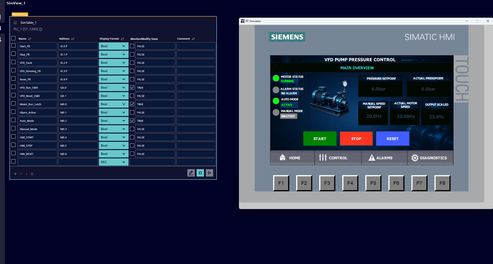

### Auto Control Mode

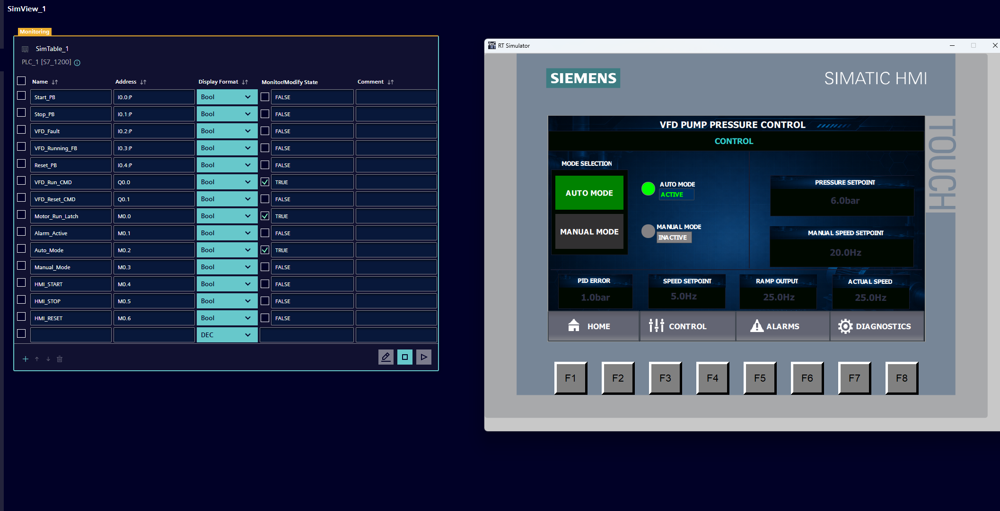

### Manual Control Mode

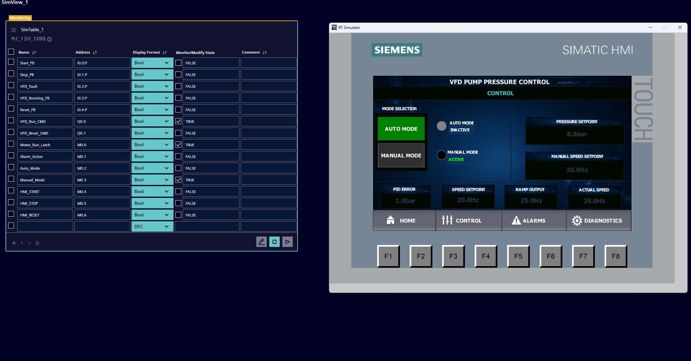

### Diagnostics Page

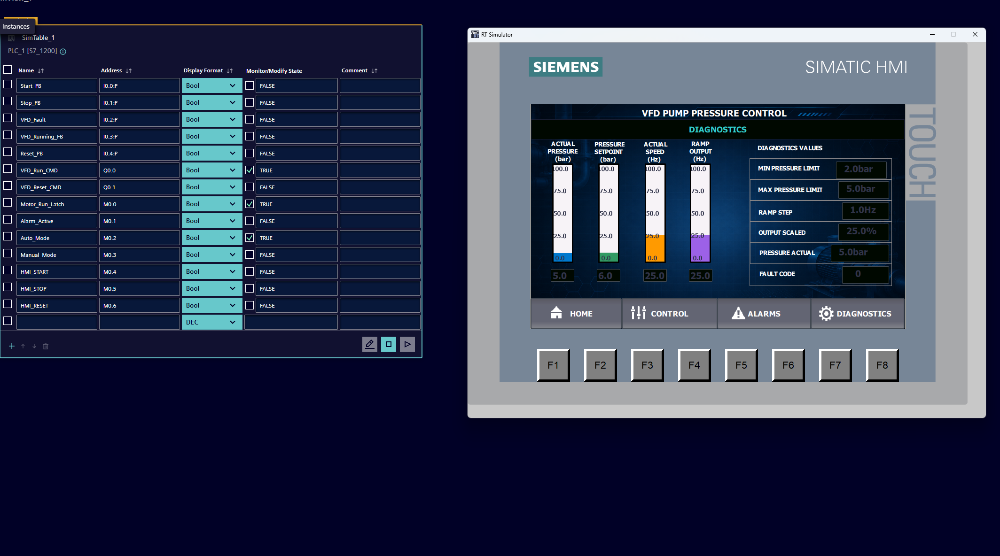

### Low Pressure Alarm

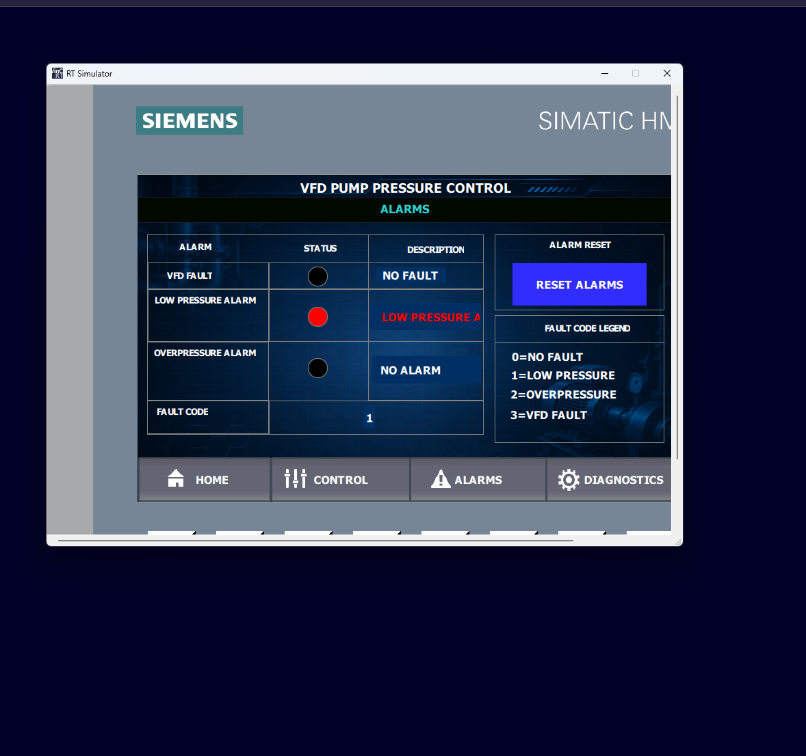

### Overpressure Alarm

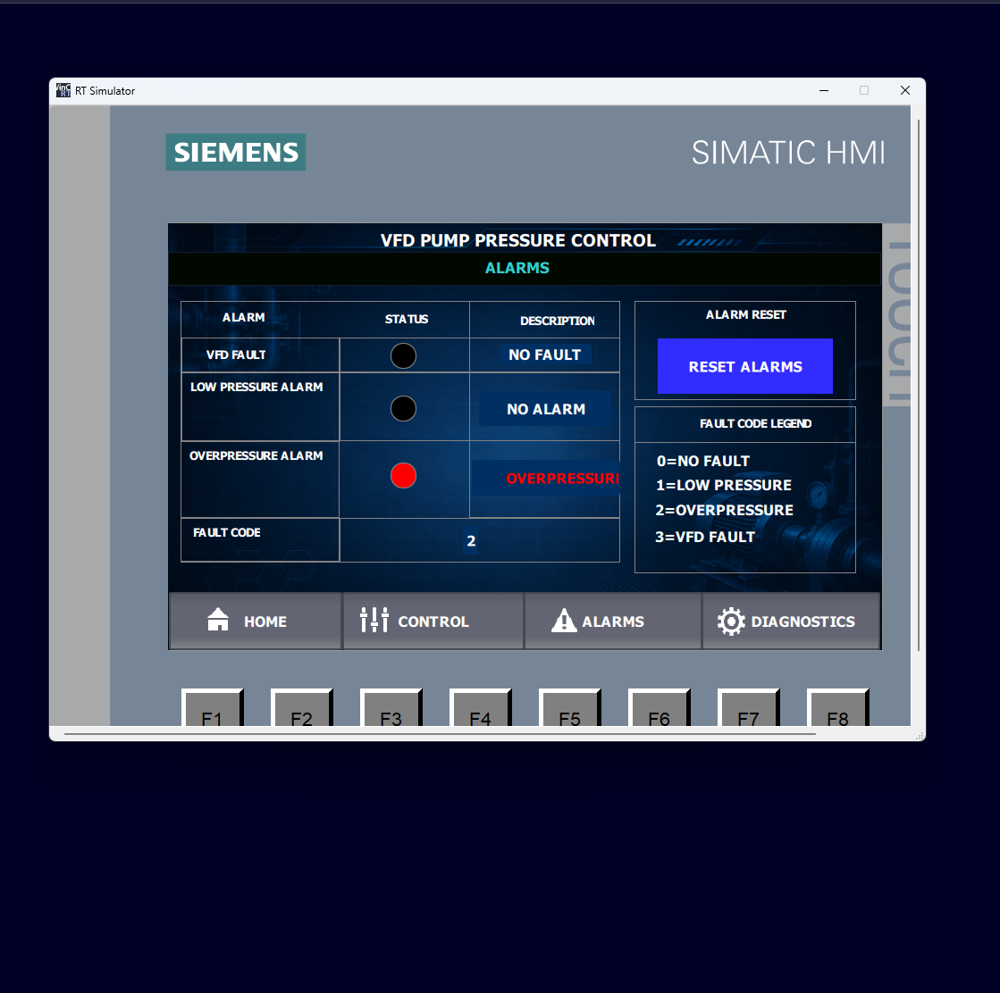

### VFD Fault Alarm

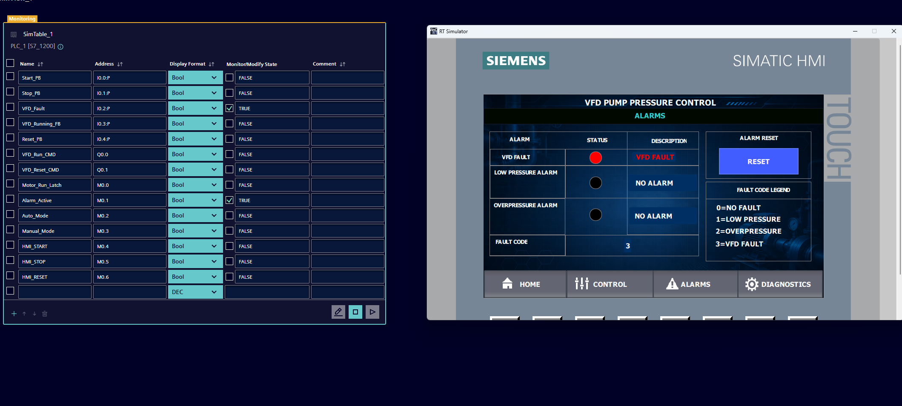

---

## PLC Logic

### Main PLC Logic Part 1

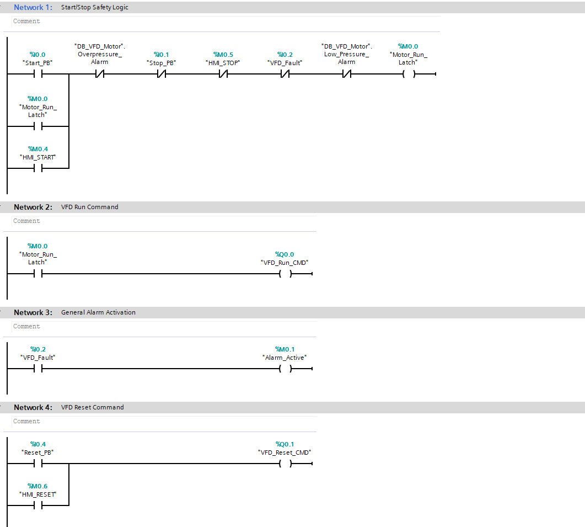

### Main PLC Logic Part 2

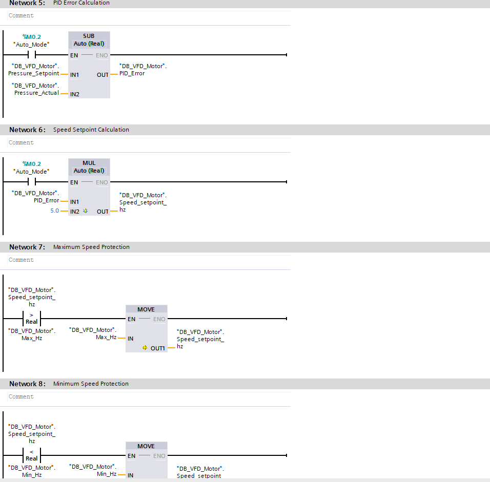

### Main PLC Logic Part 3

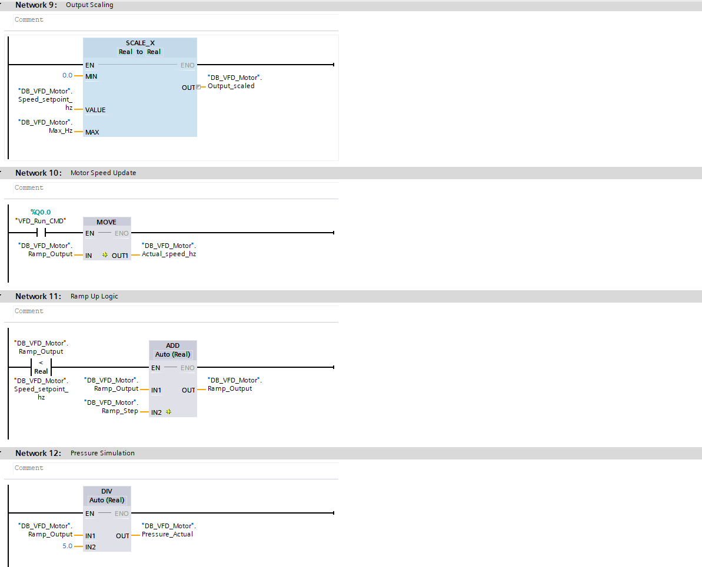

### Main PLC Logic Part 4

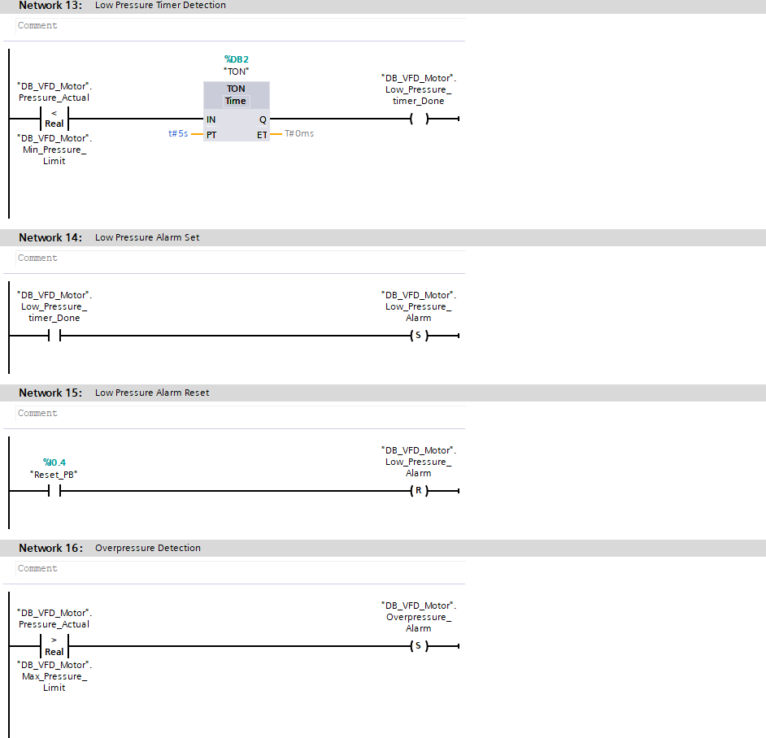

### Main PLC Logic Part 5

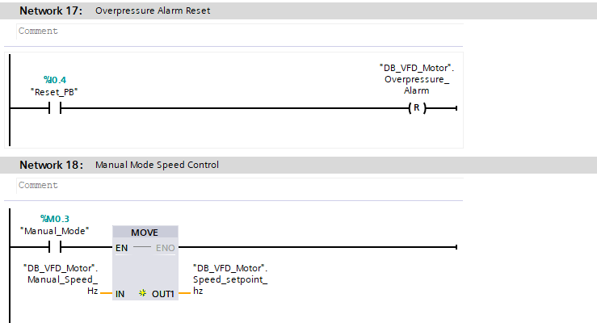

### Main PLC Logic Part 6

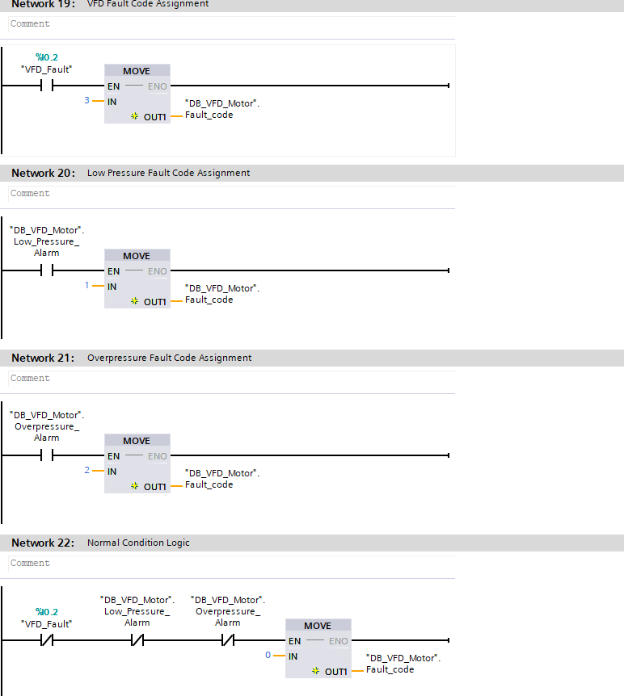

### Main PLC Logic Part 7

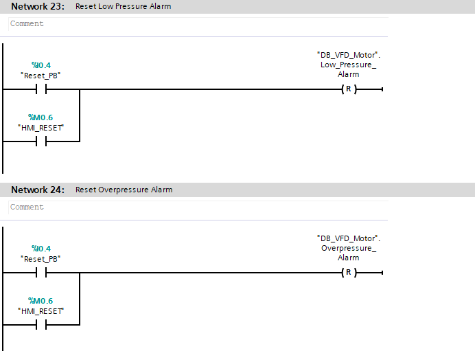
